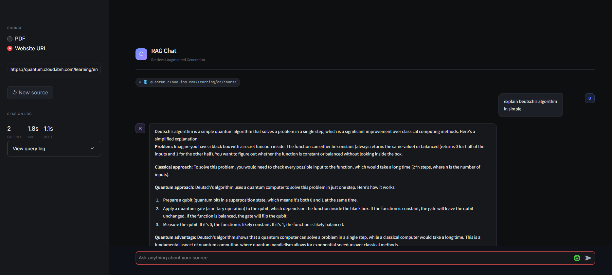

# 🤖 RAG Chat — Chat with PDF or Website

> A conversational AI app that lets you chat with any PDF document or website using Retrieval-Augmented Generation (RAG) with memory, source citations, and performance metrics.


---

## 📸 Demo

> _Add your screenshot here — replace `demo.png` with your actual file_



---

## ✨ Features

- 📄 **Chat with PDF** — Upload any PDF and ask questions about its content
- 🌐 **Chat with Website** — Paste any URL and instantly chat with that page
- 🧠 **Conversation Memory** — Ask follow-up questions naturally without repeating context
- 📌 **Source Citations** — Every answer shows exactly which page or URL it came from
- ⚡ **Performance Metrics** — Real-time response time tracking per question
- 🔄 **Reset Anytime** — Switch between sources without restarting the app

---

## 🛠️ Tech Stack

| Component        | Technology                          |
|-----------------|--------------------------------------|
| LLM             | Llama 3.1 8B via Groq API            |
| Embeddings      | `all-MiniLM-L6-v2` (HuggingFace)    |
| Vector Store    | FAISS (Facebook AI Similarity Search)|
| Framework       | LangChain LCEL + LangChain Chains    |
| Chat Memory     | LangChain `RunnableWithMessageHistory` |
| Frontend        | Streamlit                            |
| PDF Loader      | PyPDF via LangChain Community        |
| Web Loader      | LangChain `WebBaseLoader`            |
| API Key Mgmt    | python-dotenv                        |

---

## 🧠 How It Works

```
                    INDEXING (runs once)
┌─────────┐    ┌────────┐    ┌────────────┐    ┌─────────────┐
│PDF / URL│───▶│ Chunks │───▶│ Embeddings │───▶│ FAISS Index │
└─────────┘    └────────┘    └────────────┘    └─────────────┘

                    QUERYING (runs every question)
┌──────────┐    ┌────────────┐    ┌─────────────┐    ┌─────┐    ┌────────┐
│ Question │───▶│ Embedding  │───▶│ FAISS Search│───▶│ LLM │───▶│ Answer │
└──────────┘    └────────────┘    └─────────────┘    └─────┘    └────────┘
                                         │                ▲
                                    Top 3 chunks    Chat History
```

**Key concept:** FAISS finds the most semantically similar chunks to your question. Those chunks + your question + chat history go to the LLM, which generates a grounded answer — not a hallucination.

---

## 🚀 Getting Started

### Prerequisites

- Python 3.10+
- A free [Groq API key](https://console.groq.com) (no credit card required)

### Installation

**1. Clone the repository**
```bash
git clone https://github.com/r-makasana/rag-chat
cd rag-chat
```

**2. Create a virtual environment**
```bash
python -m venv rag_env

# Windows
rag_env\Scripts\activate

# macOS/Linux
source rag_env/bin/activate
```

**3. Install dependencies**
```bash
pip install -r requirements.txt
```

**4. Set up your API key**

Create a `.env` file in the root folder:
```env
GROQ_API_KEY=your_groq_api_key_here
```

**5. Run the app**
```bash
streamlit run app.py
```

Open `http://localhost:8501` in your browser.

---

## 💬 Usage

### Chat with a PDF
1. Select **PDF** in the sidebar
2. Upload any `.pdf` file
3. Wait for "PDF ready!" confirmation
4. Start asking questions in the chat box

### Chat with a Website
1. Select **Website URL** in the sidebar
2. Paste a full URL (e.g. `https://en.wikipedia.org/wiki/Quantum_computing`)
3. Wait for "Website loaded!" confirmation
4. Start asking questions

### Follow-up Questions (Chat Memory in action)
```
You:  "What is quantum entanglement?"
Bot:  [detailed explanation]

You:  "Can you explain that more simply?"     ← no need to repeat context
Bot:  [simpler explanation of entanglement]

You:  "How is it used in quantum computing?"  ← still remembers the topic
Bot:  [relevant answer]
```

---

## 📊 Performance

Tested on IBM Quantum Platform documentation (`quantum.cloud.ibm.com`):

| Metric           | Result  |
|-----------------|---------|
| Avg response time | ~1.4s  |
| Fastest response  | ~1.08s |
| Source citations  | ✅ Every answer |
| Follow-up accuracy | ✅ Confirmed |

---

## 📁 Project Structure

```
rag-chat/
├── app.py              # Main Streamlit app with chat UI
├── rag.py              # Core RAG pipeline (terminal version)
├── requirements.txt    # Pinned dependencies
├── .env                # API keys (not committed to Git)
├── .gitignore          # Excludes venv, .env, __pycache__
└── README.md           # This file
```

---

## 📦 Requirements

```
langchain==0.3.25
langchain-core==0.3.65
langchain-community==0.3.24
langchain-text-splitters==0.3.8
langchain-huggingface==0.1.2
langchain-groq==0.3.2
faiss-cpu==1.9.0
pypdf==5.1.0
sentence-transformers==3.3.1
streamlit==1.41.0
python-dotenv==1.0.1
validators==0.34.0
beautifulsoup4==4.12.3
```

---

## 🔮 Future Improvements

- [ ] Multi-document support (upload multiple PDFs at once)
- [ ] Advanced RAG with reranking (Cohere Reranker)
- [ ] Export chat history as PDF
- [ ] Deploy to Streamlit Cloud
- [ ] Add evaluation metrics (faithfulness, relevance scores)

---


